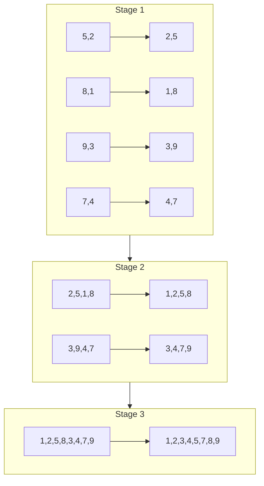

# Bitonic Sort Algorithm

Detailed implementation of the GPU-accelerated Bitonic Sort.

## Algorithm Overview

Bitonic sort is a parallel comparison-based sorting algorithm. A **bitonic sequence** is a sequence that first monotonically increases and then monotonically decreases (or vice versa).

### Complexity

- **Time**: O(n log²n)
- **Space**: O(1) - in-place sorting
- **Parallelism**: Highly parallelizable

### Algorithm Stages

```
Stage 1: Create bitonic sequences of length 2
Stage 2: Create bitonic sequences of length 4
Stage 3: Create bitonic sequences of length 8
...
Stage log₂(n): Final sorted sequence
```

## Visual Explanation



## WGSL Implementation

### Compare and Swap

```wgsl
// Compare and swap operation
fn compare_and_swap(i: u32, j: u32, ascending: bool) {
  let a = data[i];
  let b = data[j];

  if ((a > b) == ascending) {
    data[i] = b;
    data[j] = a;
  }
}
```

### Local Sort (Within Workgroup)

```wgsl
@compute @workgroup_size(256)
fn bitonic_sort_local(
  @builtin(global_invocation_id) global_id: vec3<u32>,
  @builtin(local_invocation_id) local_id: vec3<u32>
) {
  let idx = global_id.x;
  let local_idx = local_id.x;

  // Load data into shared memory
  if (idx < uniforms.total_size) {
    shared_data[local_idx] = data[idx];
  } else {
    shared_data[local_idx] = 0xFFFFFFFFu;  // Max value for padding
  }

  workgroupBarrier();

  // Perform bitonic sort within workgroup
  for (var stage: u32 = 0u; stage < 8u; stage++) {
    for (var pass: u32 = stage + 1u; pass > 0u; pass--) {
      let pair_distance = 1u << (pass - 1u);
      let block_size = 1u << (stage + 1u);
      let partner = local_idx ^ pair_distance;

      if (partner > local_idx && partner < WORKGROUP_SIZE) {
        let ascending = ((local_idx / block_size) % 2u) == 0u;
        let a = shared_data[local_idx];
        let b = shared_data[partner];

        if ((a > b) == ascending) {
          shared_data[local_idx] = b;
          shared_data[partner] = a;
        }
      }

      workgroupBarrier();
    }
  }

  // Write back to global memory
  if (idx < uniforms.total_size) {
    data[idx] = shared_data[local_idx];
  }
}
```

### Global Sort (Across Workgroups)

```wgsl
@compute @workgroup_size(256)
fn bitonic_sort_global(
  @builtin(global_invocation_id) global_id: vec3<u32>
) {
  let idx = global_id.x;

  if (idx >= uniforms.total_size) { return; }

  let pair_distance = 1u << uniforms.pass_num;
  let block_size = 1u << (uniforms.stage + 1u);
  let partner = idx ^ pair_distance;

  if (partner > idx && partner < uniforms.total_size) {
    let ascending = ((idx / block_size) % 2u) == 0u;
    let a = data[idx];
    let b = data[partner];

    if ((a > b) == ascending) {
      data[idx] = b;
      data[partner] = a;
    }
  }
}
```

## TypeScript Implementation

```typescript
export class BitonicSorter {
  private pipelineLocal: GPUComputePipeline;
  private pipelineGlobal: GPUComputePipeline;
  private bindGroupLayout: GPUBindGroupLayout;
  private uniformBuffer: GPUBuffer;

  async sort(data: Uint32Array): Promise<SortResult> {
    const startTime = performance.now();

    // Pad to power of 2
    const paddedSize = nextPowerOf2(data.length);
    const padded = new Uint32Array(paddedSize);
    padded.set(data);

    // Create GPU buffer
    const dataBuffer = this.createStorageBuffer(padded);

    // Calculate stages
    const numStages = Math.log2(paddedSize);
    const localStages = Math.log2(WORKGROUP_SIZE);

    // Step 1: Local sort within workgroups
    this.updateUniforms(0, 0, paddedSize);
    this.dispatchLocalSort(Math.ceil(paddedSize / WORKGROUP_SIZE));

    // Step 2: Global merge stages
    for (let stage = localStages; stage < numStages; stage++) {
      for (let pass = stage; pass >= 0; pass--) {
        this.updateUniforms(stage, pass, paddedSize);
        this.dispatchGlobalSort(paddedSize / 2);
      }
    }

    // Read back results
    const result = await this.readBuffer(dataBuffer, data.byteLength);
    const endTime = performance.now();

    return {
      sortedData: result.slice(0, data.length),
      gpuTimeMs: endTime - startTime,
      totalTimeMs: endTime - startTime,
    };
  }
}
```

## Performance Characteristics

| Array Size | GPU Passes | Memory Accesses |
| ---------- | ---------- | --------------- |
| 256        | 64         | 16,384          |
| 1,024      | 100        | 102,400         |
| 65,536     | 256        | 16,777,216      |
| 1,048,576  | 400        | 419,430,400     |

## Best Practices

### 1. Power-of-Two Sizes

Bitonic sort works most efficiently with power-of-2 sized arrays:

```typescript
// Good: Power of 2
const data = new Uint32Array(65536);

// Requires padding: Not power of 2
const data = new Uint32Array(100000);
// Library automatically pads to 131072
```

### 2. Reuse GPU Context

Create the context once and reuse it:

```typescript
// ✅ Good: Reuse context
const gpu = new GPUContext();
await gpu.initialize();
const sorter = new BitonicSorter(gpu);

for (const data of datasets) {
  await sorter.sort(data);
}

gpu.destroy();

// ❌ Bad: Create context for each sort
for (const data of datasets) {
  const gpu = new GPUContext();
  await gpu.initialize();
  const sorter = new BitonicSorter(gpu);
  await sorter.sort(data);
  gpu.destroy();
}
```

### 3. Batch Processing

Sort multiple arrays in sequence:

```typescript
const results = [];
for (const data of dataArray) {
  results.push(await sorter.sort(data));
}
```

## Limitations

1. **Power-of-2 padding**: Non-power-of-2 arrays require padding
2. **Not stable**: Equal elements may be reordered
3. **Memory overhead**: Requires GPU buffer allocation

## See Also

- [Radix Sort Algorithm](/algorithm-radix)
- [Architecture](/architecture)
- [Performance Benchmarks](/performance)
