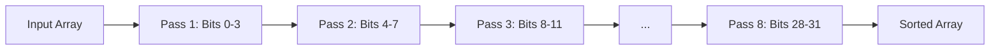
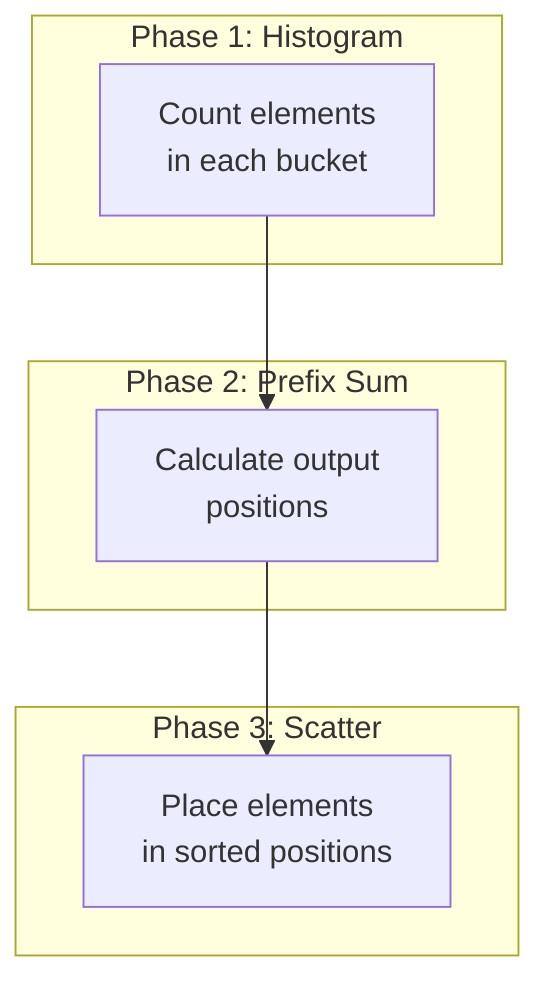

# Radix Sort Algorithm

Detailed implementation of the GPU-accelerated Radix Sort.

## Algorithm Overview

Radix sort is a non-comparison sorting algorithm that processes integers digit by digit (or bit by bit).

### Complexity

- **Time**: O(n × k), where k = number of digit positions
- **Space**: O(n) - requires auxiliary array
- **Stability**: Stable sort

### Our Implementation

- **Radix**: 16 (2⁴ = 16 buckets)
- **Bits per pass**: 4
- **Total passes**: 8 (for 32-bit integers)

## Algorithm Phases



## Phase Details

Each pass consists of three operations:



### 1. Histogram Phase

Count how many elements fall into each bucket:

```wgsl
const RADIX: u32 = 16u;

var<workgroup> local_histogram: array<atomic<u32>, 16>;

@compute @workgroup_size(256)
fn compute_histogram(
  @builtin(global_invocation_id) global_id: vec3<u32>,
  @builtin(local_invocation_id) local_id: vec3<u32>
) {
  // Initialize local histogram
  if (local_id.x < RADIX) {
    atomicStore(&local_histogram[local_id.x], 0u);
  }
  workgroupBarrier();

  // Count elements in local histogram
  if (global_id.x < uniforms.total_size) {
    let value = input_data[global_id.x];
    let digit = get_digit(value, uniforms.bit_offset);
    atomicAdd(&local_histogram[digit], 1u);
  }
  workgroupBarrier();

  // Write to global histogram
  if (local_id.x < RADIX) {
    let count = atomicLoad(&local_histogram[local_id.x]);
    atomicAdd(&histogram[local_id.x], count);
  }
}
```

### 2. Prefix Sum Phase

Calculate the starting position for each bucket:

```typescript
function prefixSum(histogram: Uint32Array): Uint32Array {
  const result = new Uint32Array(histogram.length);
  let sum = 0;

  for (let i = 0; i < histogram.length; i++) {
    result[i] = sum;
    sum += histogram[i];
  }

  return result;
}

// Example:
// histogram: [2, 3, 1, 0, 4, ...]
// prefixSum: [0, 2, 5, 6, 6, ...]
```

### 3. Scatter Phase

Place elements in their sorted positions:

```wgsl
@compute @workgroup_size(256)
fn scatter(
  @builtin(global_invocation_id) global_id: vec3<u32>,
  @builtin(local_invocation_id) local_id: vec3<u32>
) {
  let gid = global_id.x;

  // Load prefix sums to shared memory
  if (local_id.x < RADIX) {
    local_prefix[local_id.x] = prefix_sums[local_id.x];
    atomicStore(&local_histogram[local_id.x], 0u);
  }
  workgroupBarrier();

  if (gid < uniforms.total_size) {
    let value = input_data[gid];
    let digit = get_digit(value, uniforms.bit_offset);

    // Atomically get position within bucket
    let local_offset = atomicAdd(&local_histogram[digit], 1u);
    let global_offset = local_prefix[digit] + local_offset;

    output_data[global_offset] = value;
  }
}
```

## Digit Extraction

Extract 4 bits at the given offset:

```wgsl
fn get_digit(value: u32, bit_offset: u32) -> u32 {
  return (value >> bit_offset) & 0xFu;
}
```

| Bit Offset | Bits  | Example Value | Digit    |
| ---------- | ----- | ------------- | -------- |
| 0          | 0-3   | 0xABCD        | 0xD (13) |
| 4          | 4-7   | 0xABCD        | 0xC (12) |
| 8          | 8-11  | 0xABCD        | 0xB (11) |
| 12         | 12-15 | 0xABCD        | 0xA (10) |

## Memory Layout

```
For 32-bit integers with 4-bit radix:
┌─────────────────┬─────────────────┬─────────────────┐
│   Input Array   │   Histogram     │  Prefix Sums    │
│   (n elements)  │  (16 integers)  │  (16 integers)  │
└─────────────────┴─────────────────┴─────────────────┘

Per-pass memory:
- Input buffer: n × 4 bytes
- Output buffer: n × 4 bytes
- Histogram: 16 × 4 bytes
- Prefix sums: 16 × 4 bytes
```

## TypeScript Implementation

```typescript
export class RadixSorter {
  private histogramPipeline: GPUComputePipeline;
  private scatterPipeline: GPUComputePipeline;

  async sort(data: Uint32Array): Promise<SortResult> {
    const startTime = performance.now();

    // Create buffers
    const inputBuffer = this.createStorageBuffer(
      data,
      GPUBufferUsage.STORAGE | GPUBufferUsage.COPY_SRC
    );
    const outputBuffer = this.createStorageBuffer(
      data.length,
      GPUBufferUsage.STORAGE | GPUBufferUsage.COPY_DST
    );
    const histogramBuffer = this.createStorageBuffer(16, GPUBufferUsage.STORAGE);
    const prefixBuffer = this.createStorageBuffer(
      16,
      GPUBufferUsage.STORAGE | GPUBufferUsage.COPY_DST
    );

    let currentInput = inputBuffer;
    let currentOutput = outputBuffer;

    // 8 passes for 32-bit integers (4 bits per pass)
    for (let bitOffset = 0; bitOffset < 32; bitOffset += 4) {
      // Reset histogram
      this.device.queue.writeBuffer(histogramBuffer, 0, new Uint32Array(16));

      // Phase 1: Compute histogram
      this.dispatchHistogram(currentInput, histogramBuffer, bitOffset, data.length);
      await this.device.queue.onSubmittedWorkDone();

      // Phase 2: Prefix sum (on CPU for simplicity)
      const histogram = await this.readBuffer(histogramBuffer, 64);
      const prefixSums = this.computePrefixSum(new Uint32Array(histogram));
      this.device.queue.writeBuffer(prefixBuffer, 0, prefixSums);

      // Phase 3: Scatter
      this.dispatchScatter(currentInput, currentOutput, prefixBuffer, bitOffset, data.length);

      // Swap buffers
      [currentInput, currentOutput] = [currentOutput, currentInput];
    }

    // Read result (now in input buffer after odd number of swaps)
    const result = await this.readBuffer(currentInput, data.byteLength);
    const endTime = performance.now();

    return {
      sortedData: result,
      gpuTimeMs: endTime - startTime,
      totalTimeMs: endTime - startTime,
    };
  }
}
```

## Performance Comparison

| Array Size | Radix Sort | Bitonic Sort | Winner  |
| ---------- | ---------- | ------------ | ------- |
| 65,536     | 0.31ms     | 0.28ms       | Bitonic |
| 262,144    | 0.89ms     | 0.94ms       | Radix   |
| 1,048,576  | 2.8ms      | 3.2ms        | Radix   |
| 4,194,304  | 10.5ms     | 12.1ms       | Radix   |

::: tip When to Use Radix Sort
Radix sort excels on **large integer arrays** (≥ 250K elements). For smaller arrays or non-integer data, Bitonic sort may be more appropriate.
:::

## Optimization: GPU Prefix Sum

For very large arrays, GPU-based prefix sum (Blelloch scan) can improve performance:

```wgsl
// Parallel prefix sum using Blelloch algorithm
@compute @workgroup_size(256)
fn prefix_sum(...) {
  // Up-sweep (reduce)
  // Down-sweep
  // ...
}
```

This is planned for future implementation.

## Limitations

1. **Uint32Array only**: Specialized for unsigned 32-bit integers
2. **Memory overhead**: Requires input and output buffers
3. **Not comparison-based**: Cannot sort arbitrary data types

## See Also

- [Bitonic Sort Algorithm](/algorithm-bitonic)
- [Architecture](/architecture)
- [Performance Benchmarks](/performance)
