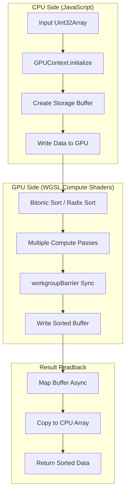
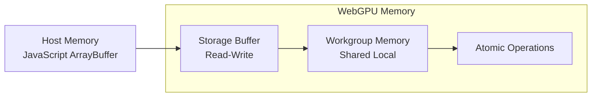

# Architecture

System design and data flow for GPU-accelerated sorting.

## Overview

WebGPU Sorting implements two GPU-accelerated sorting algorithms using WebGPU compute shaders written in WGSL (WebGPU Shading Language).



## System Architecture

```
┌─────────────────────────────────────────────────────────────┐
│                      User Interface                         │
│  ┌─────────────┐  ┌─────────────┐  ┌─────────────────────┐ │
│  │ Controls    │  │ Progress    │  │ Results Display     │ │
│  └─────────────┘  └─────────────┘  └─────────────────────┘ │
└─────────────────────────────────────────────────────────────┘
                              │
                              ▼
┌─────────────────────────────────────────────────────────────┐
│                    Sorting API Layer                        │
│  ┌─────────────────┐  ┌─────────────────┐  ┌─────────────┐ │
│  │ BitonicSorter   │  │ RadixSorter     │  │ Benchmark   │ │
│  └─────────────────┘  └─────────────────┘  └─────────────┘ │
└─────────────────────────────────────────────────────────────┘
                              │
                              ▼
┌─────────────────────────────────────────────────────────────┐
│                   WebGPU Core Layer                         │
│  ┌─────────────────┐  ┌─────────────────┐                  │
│  │ GPUContext      │  │ BufferManager   │                  │
│  └─────────────────┘  └─────────────────┘                  │
└─────────────────────────────────────────────────────────────┘
                              │
                              ▼
┌─────────────────────────────────────────────────────────────┐
│                    WGSL Compute Shaders                     │
│  ┌─────────────────┐  ┌─────────────────┐                  │
│  │ bitonic.wgsl    │  │ radix.wgsl      │                  │
│  └─────────────────┘  └─────────────────┘                  │
└─────────────────────────────────────────────────────────────┘
```

## Core Components

### GPUContext

Manages WebGPU device lifecycle and provides a unified interface for GPU operations.

```typescript
class GPUContext {
  private adapter: GPUAdapter | null = null;
  private device: GPUDevice | null = null;

  static isSupported(): boolean {
    return typeof navigator !== 'undefined' && 'gpu' in navigator;
  }

  async initialize(config?: GPUContextConfig): Promise<void> {
    this.adapter = await navigator.gpu.requestAdapter({
      powerPreference: config?.powerPreference ?? 'high-performance',
    });
    this.device = await this.adapter.requestDevice();
  }

  getDevice(): GPUDevice {
    return this.device;
  }

  destroy(): void {
    this.device?.destroy();
  }
}
```

### BufferManager

Handles GPU memory allocation and data transfer between CPU and GPU.

```typescript
class BufferManager {
  createStorageBuffer(data: Uint32Array): GPUBuffer {
    const buffer = this.device.createBuffer({
      size: data.byteLength,
      usage: GPUBufferUsage.STORAGE | GPUBufferUsage.COPY_SRC | GPUBufferUsage.COPY_DST,
      mappedAtCreation: true,
    });
    new Uint32Array(buffer.getMappedRange()).set(data);
    buffer.unmap();
    return buffer;
  }

  async readBuffer(buffer: GPUBuffer, size: number): Promise<Uint32Array> {
    // Create staging buffer, copy, map, and read
  }
}
```

## Data Flow

### Memory Model



### Sorting Pipeline

| Phase | Operation | Memory      | Time               |
| ----- | --------- | ----------- | ------------------ |
| 1     | Upload    | CPU → GPU   | O(n)               |
| 2     | Sort      | GPU Compute | O(log²n) or O(n×k) |
| 3     | Readback  | GPU → CPU   | O(n)               |

## Algorithm Comparison

| Feature        | Bitonic Sort     | Radix Sort     |
| -------------- | ---------------- | -------------- |
| **Complexity** | O(n log²n)       | O(n × k)       |
| **Type**       | Comparison-based | Non-comparison |
| **Data Type**  | Any comparable   | Uint32 only    |
| **Stability**  | Not stable       | Stable         |
| **Best For**   | General purpose  | Large integers |
| **GPU Passes** | log²n            | k × 3          |

## Performance Considerations

### When GPU Sorting Wins

GPU sorting becomes advantageous when:

1. **Array size > 65,536** - Buffer transfer overhead is amortized
2. **Repeated sorting** - GPU context can be reused
3. **Batch processing** - Multiple sorts share setup cost

### Optimization Techniques

1. **Shared Memory (Workgroup Memory)**

   ```wgsl
   var<workgroup> shared_data: array<u32, 256>;
   // Much faster than global memory access
   ```

2. **Coalesced Memory Access**

   ```wgsl
   // ✅ Good: Consecutive access
   let value = data[global_id.x];

   // ❌ Bad: Strided access
   let value = data[global_id.x * stride];
   ```

3. **Minimize Synchronization**
   ```wgsl
   // Only barrier when data is shared between threads
   workgroupBarrier();
   ```

## Error Handling

```typescript
try {
  const gpu = new GPUContext();
  await gpu.initialize();
  const sorter = new BitonicSorter(gpu);
  const result = await sorter.sort(data);
} catch (error) {
  if (error instanceof WebGPUNotSupportedError) {
    // Fallback to CPU sort
    data.sort((a, b) => a - b);
  }
}
```

## Next Steps

- [Bitonic Sort Algorithm](/algorithm-bitonic) - Detailed implementation
- [Radix Sort Algorithm](/algorithm-radix) - Detailed implementation
- [Performance Benchmarks](/performance) - Real-world measurements
