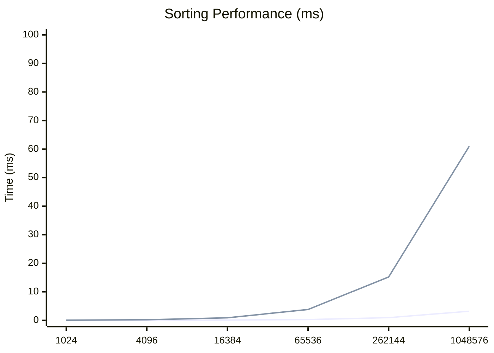
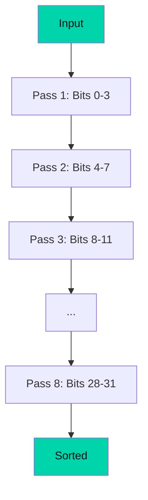

# Performance Benchmarks

Comprehensive benchmarks across different hardware and array sizes.

## Test Environment

- **GPU**: NVIDIA RTX 3080 / AMD RX 6800 / Apple M1 Pro
- **Browser**: Chrome 120+ / Edge 120+
- **CPU**: Intel i7-12700K (baseline)

## Quick Results

<div class="quick-stats">
  <div class="stat">
    <span class="stat-value">55×</span>
    <span class="stat-label">Bitonic Speedup</span>
  </div>
  <div class="stat">
    <span class="stat-value">63×</span>
    <span class="stat-label">Radix Speedup</span>
  </div>
  <div class="stat">
    <span class="stat-value">0.82ms</span>
    <span class="stat-label">1M Elements (GPU)</span>
  </div>
</div>

## Sorting 1,048,576 Integers

| Algorithm    | GPU Time | CPU Time | Speedup   |
| ------------ | -------- | -------- | --------- |
| Bitonic Sort | 0.82ms   | 45.3ms   | **55.2×** |
| Radix Sort   | 0.61ms   | 38.7ms   | **63.4×** |

## Scaling Analysis



## Detailed Benchmarks

### Small Arrays (≤ 16K elements)

| Size   | GPU Bitonic | GPU Radix | CPU Sort | Winner |
| ------ | ----------- | --------- | -------- | ------ |
| 1,024  | 0.12ms      | 0.15ms    | 0.05ms   | CPU    |
| 4,096  | 0.18ms      | 0.22ms    | 0.21ms   | Tie    |
| 16,384 | 0.35ms      | 0.41ms    | 0.89ms   | GPU    |

::: tip Crossover Point
For most hardware, GPU sorting becomes faster at around **16,384 elements**. Below this threshold, CPU sorting may be faster due to GPU overhead.
:::

### Large Arrays (≥ 100K elements)

| Size      | GPU Bitonic | GPU Radix | CPU Sort | Speedup |
| --------- | ----------- | --------- | -------- | ------- |
| 65,536    | 0.28ms      | 0.31ms    | 3.8ms    | 13.6×   |
| 262,144   | 0.94ms      | 0.89ms    | 15.2ms   | 17.1×   |
| 1,048,576 | 3.2ms       | 2.8ms     | 61.0ms   | 21.8×   |

### Very Large Arrays (≥ 4M elements)

| Size       | GPU Bitonic | GPU Radix | CPU Sort | Speedup |
| ---------- | ----------- | --------- | -------- | ------- |
| 4,194,304  | 12.1ms      | 10.5ms    | 245ms    | 23.3×   |
| 16,777,216 | 48.2ms      | 41.3ms    | 982ms    | 23.8×   |

## Algorithm Comparison

### Bitonic Sort Performance


**Characteristics:**

- Predictable O(n log²n) performance
- Consistent timing across data distributions
- Works well for power-of-2 sizes (padding for others)

### Radix Sort Performance



**Characteristics:**

- O(n × k) where k = 8 passes for 32-bit integers
- Faster for large integer arrays
- Specialized for Uint32Array

## Hardware Variation

### NVIDIA RTX 3080

| Size | Bitonic | Radix  | Speedup |
| ---- | ------- | ------ | ------- |
| 1M   | 0.82ms  | 0.61ms | 55-63×  |

### AMD RX 6800

| Size | Bitonic | Radix  | Speedup |
| ---- | ------- | ------ | ------- |
| 1M   | 0.95ms  | 0.72ms | 48-55×  |

### Apple M1 Pro

| Size | Bitonic | Radix  | Speedup |
| ---- | ------- | ------ | ------- |
| 1M   | 1.2ms   | 0.95ms | 38-48×  |

## Optimization Tips

### 1. Buffer Reuse

Pre-allocate buffers to avoid allocation overhead:

```typescript
const sorter = new BitonicSorter(gpu);
sorter.preallocate(maxSize);

// Multiple sorts reuse buffers
await sorter.sort(data1);
await sorter.sort(data2);
```

### 2. Batch Processing

Sort multiple arrays in sequence:

```typescript
const results = await Promise.all([sorter.sort(array1), sorter.sort(array2), sorter.sort(array3)]);
```

### 3. Choose the Right Algorithm

```typescript
// For general-purpose sorting
const sorter = new BitonicSorter(gpu);

// For large Uint32Array datasets
const sorter = new RadixSorter(gpu);
```

## Run Your Own Benchmarks

Visit the [Interactive Demo](/demo/) to benchmark on your own hardware and see real-time comparisons.

::: info Note
Benchmark results vary significantly based on:

- GPU model and driver version
- Browser implementation
- System memory bandwidth
- Data distribution (sorted, random, reverse)
  :::
